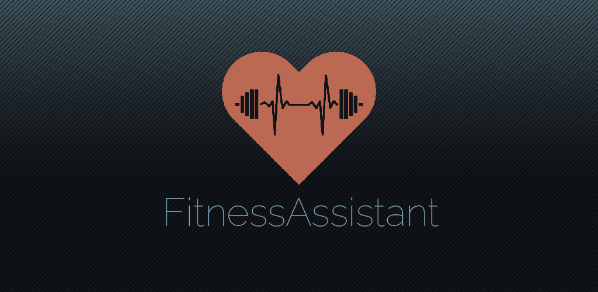
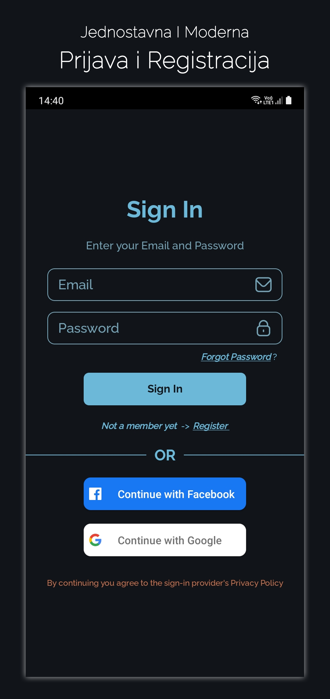
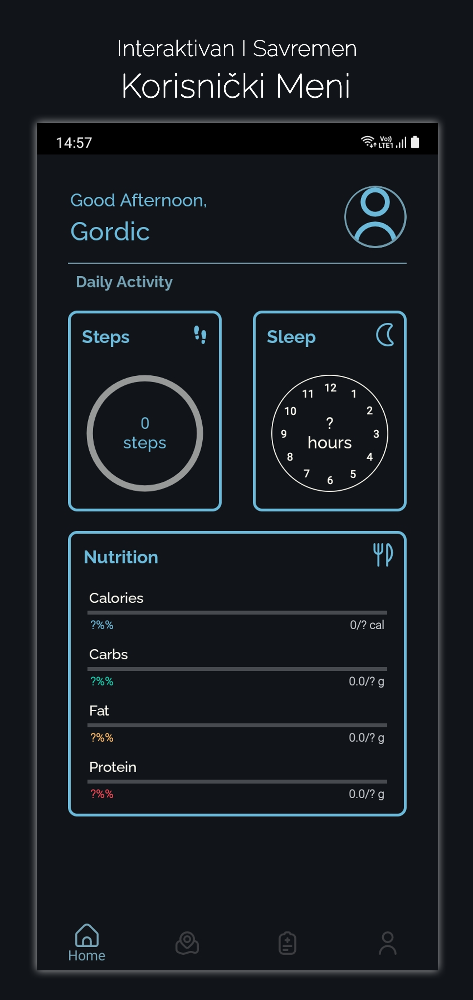
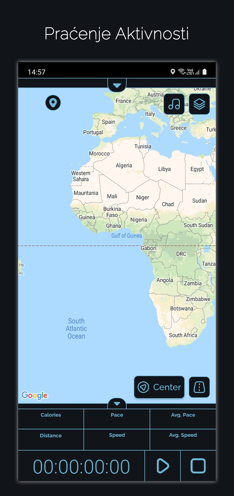
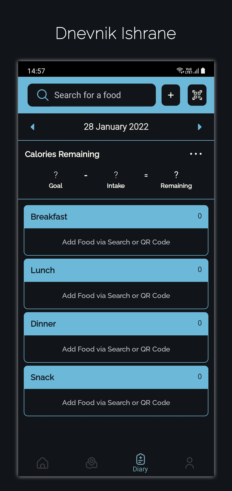
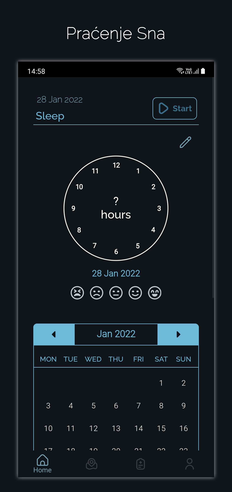
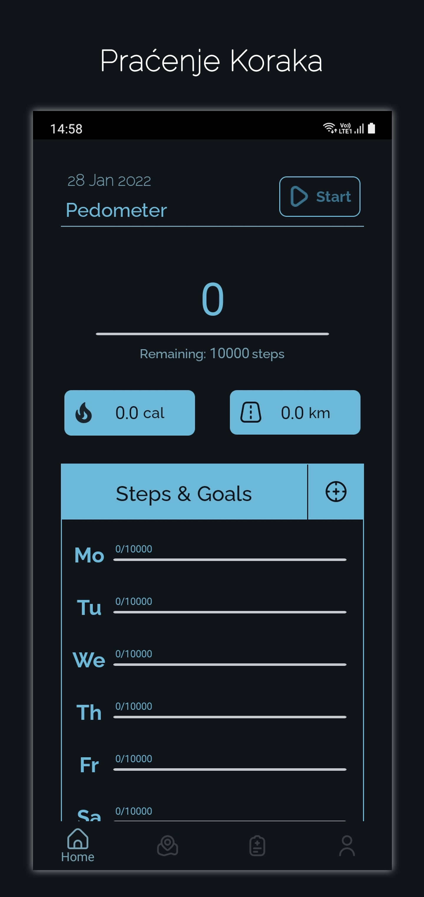

# FitnessAssistant: Your Path to a Healthier Lifestyle
FitnessAssistant is a project for the "11. MTS App Konkurs" organized by [Telekom Srbija](https://mts.rs/). Our team "ByteMinded" represented Gymnasium Jovan Jovanović Zmaj in Novi Sad.

## About

    <h3>Supported OS & Tech Used</h3>
    
    
    
    

## 
FitnessAssistant is an intuitive app developed to enhance physical health and daily lifestyle habits. It seamlessly integrates tools for tracking dietary nutrition, progress in physical activities, daily step count, and sleep quality. This app is specifically designed to counteract the sedentary tendencies of modern life, addressing issues like fatigue and overall life quality reduction due to poor habits.

A key feature of FitnessAssistant is its sleep tracking capability, enabling users to monitor sleep patterns and rate sleep quality, providing insights for rest improvement. For those keen on maintaining an active lifestyle, the app offers step tracking, calorie burn monitoring, and customizable goal setting. Additionally, a nutritional diary is included to log food intake, helping users keep a close eye on their diet.

## Screenshots

    
    
    
    
    
    

## Authors & Honorable Mentions
- [Marko Gordić](https://github.com/MarkoGordic) - Author
- [Igor Maljik](https://github.com/IgorMaljik) - Author
- [Ivana Stojanović](https://github.com/StojanovicIvana) - Team Mentor